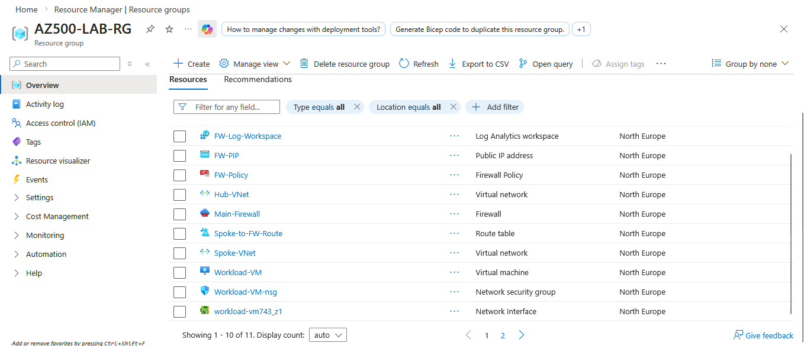
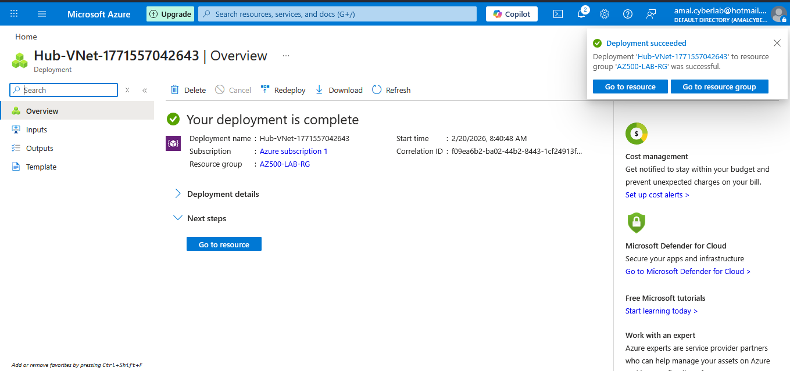
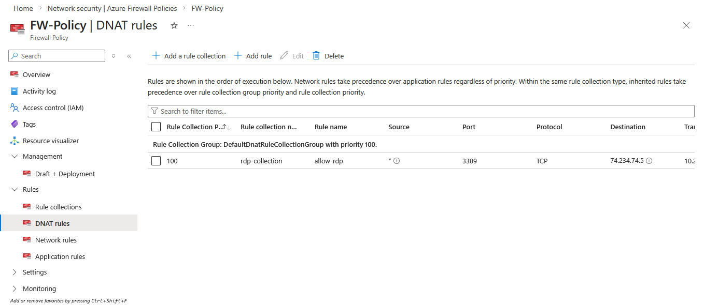
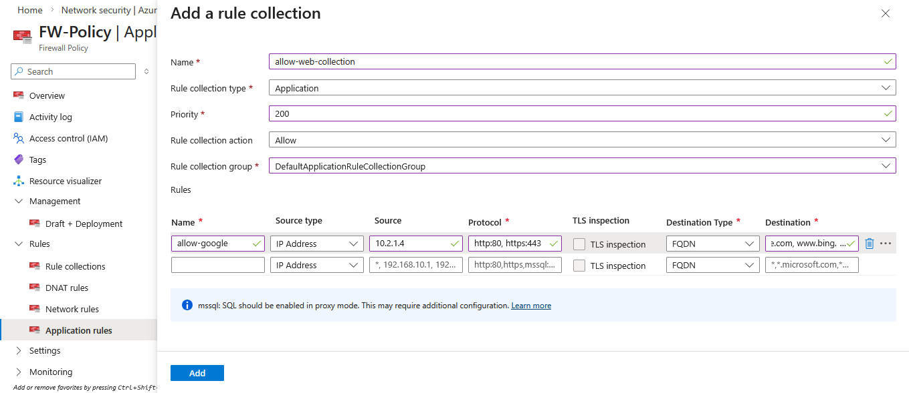
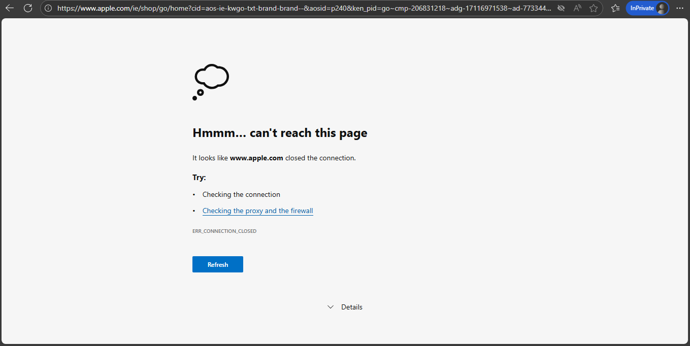

<p align="center">
  <h1 align="center">🔥 Azure Enterprise Network Security</h1>
  <h3 align="center">Hub-and-Spoke Architecture with Centralized Azure Firewall</h3>
</p>

<p align="center">
  
  
  
  
  
</p>

---

# 📌 Project Overview

This project demonstrates an **enterprise-grade network security architecture** in Microsoft Azure using a **Hub-and-Spoke topology** with centralized traffic inspection via **Azure Firewall**.

The design enforces:

- Centralized inbound traffic control (DNAT)
- Outbound internet filtering (FQDN-based rules)
- Forced tunneling using User Defined Routes (UDR)
- Zero public exposure of internal workloads
- Centralized monitoring via Log Analytics

This mirrors real-world enterprise cloud network design patterns.

---

# 🎯 Business Objective

Traditional flat network architectures introduce:

- Uncontrolled east-west traffic
- Direct public exposure of workloads
- Limited outbound filtering
- Reduced visibility into network activity

This solution enforces:

> 🔐 Segmentation → 🔍 Inspection → 🚦 Controlled Access → 📊 Monitoring

---

# 🏗️ High-Level Architecture

## 🌐 Network Layout

```mermaid
flowchart LR
Internet --> FW[Azure Firewall Public IP]
FW -->|DNAT| VM[Private VM - Spoke VNet]
VM -->|Outbound via UDR| FW
FW --> Internet

 ```

---

# 📸 Deployment Walkthrough (Step-by-Step with Screenshots)

## 🗂️ 1️⃣ Resource Group Creation

All components were deployed inside a dedicated resource group.



---

## 🌐 2️⃣ Virtual Network (Hub & Spoke) Creation

Created Hub VNet and Spoke VNet to ensure proper network segmentation.



---

## 🔥 3️⃣ Azure Firewall Deployment

Azure Firewall deployed inside **AzureFirewallSubnet** within the Hub VNet.


---

## 🌍 4️⃣ Public IP Configuration

Assigned a Public IP address to Azure Firewall for controlled inbound DNAT access.


---

## 🛣️ 5️⃣ Route Table (UDR) Configuration

Configured a User Defined Route (UDR) in the Spoke subnet:


This enforces forced tunneling of all outbound traffic.


---

## 🔐 6️⃣ Network Rule Configuration

Configured required Network Rules within the Azure Firewall policy.



---

## 🌎 7️⃣ Application Rule (FQDN Filtering)

Configured Application Rules to explicitly allow:

- `google.com`
- `bing.com`

Default action: **Deny All**



---

## 👁️ Application Rule View

Firewall policy rule collection overview.


---

## 💻 8️⃣ Virtual Machine Deployment (No Public IP)

The Virtual Machine was deployed inside the Spoke VNet with:

- Private IP only  
- No direct public exposure  


---

# 🧪 Security Testing & Validation

## 🚫 Before Rule Configuration

Attempting internet access without proper allow rule configuration.


**Result:** Access blocked

---

## ✅ After Rule Configuration (Allowed Traffic)

Google access allowed successfully via Application Rule.


---

## 🚫 Blocked Website (Default Deny Working)

Apple.com blocked successfully due to default deny policy.



---

# 🎯 Validation Result

✔ Forced tunneling working  
✔ DNAT configuration validated  
✔ FQDN filtering enforced  
✔ Default deny posture confirmed  
✔ No public exposure of VM  
✔ Centralized inspection functioning as expected  

---

# 🏁 Final Outcome

This lab demonstrates a real-world enterprise Azure Hub-and-Spoke security architecture aligned with:

- Zero Trust principles  
- Centralized network inspection  
- Secure remote access design  
- Controlled outbound traffic filtering  

> 🔥 Enterprise-grade Azure network security implementation.


